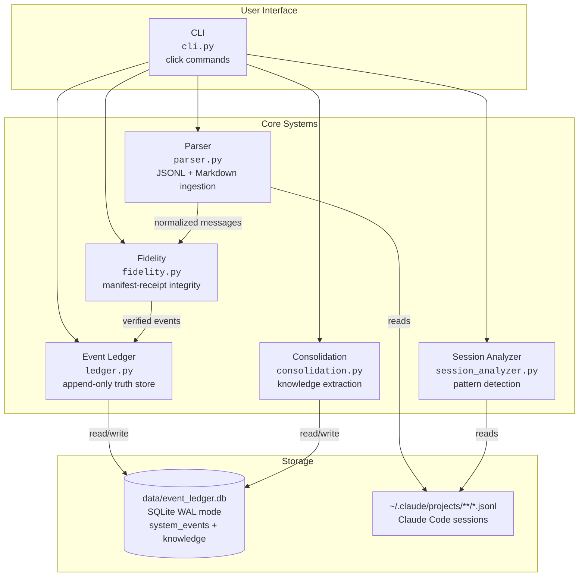
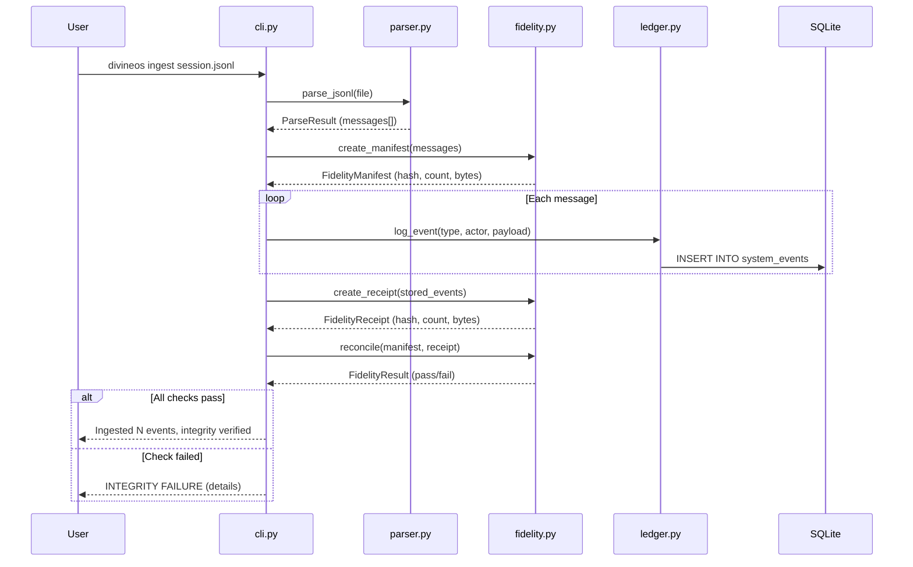
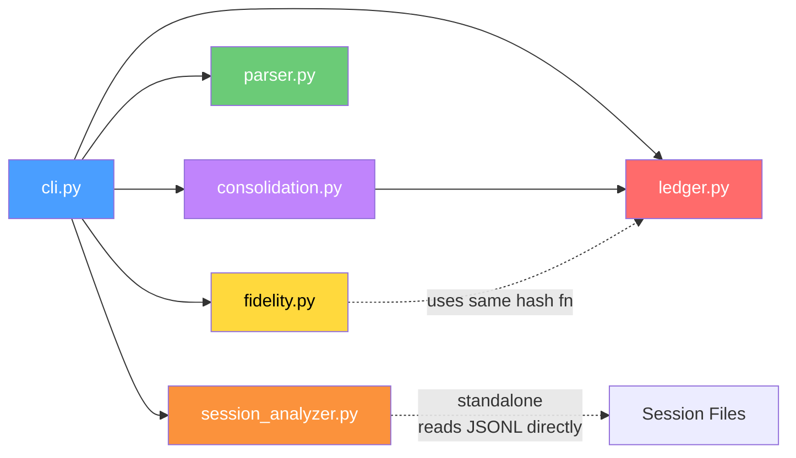
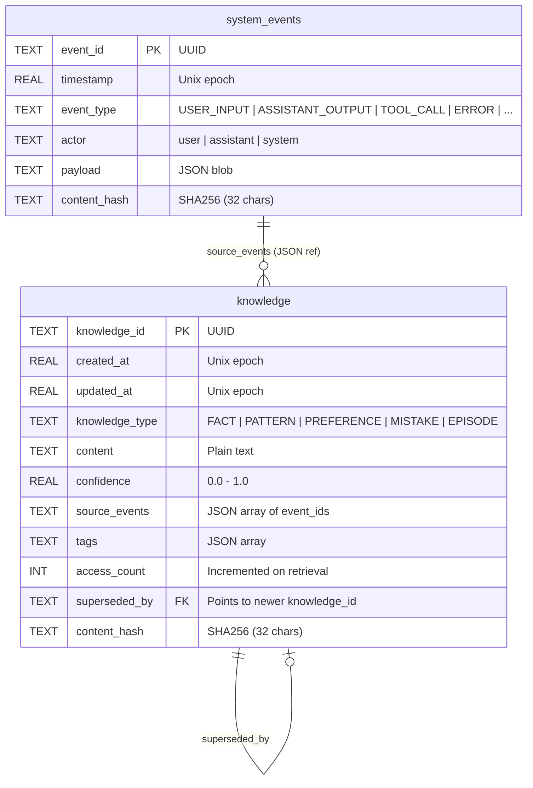
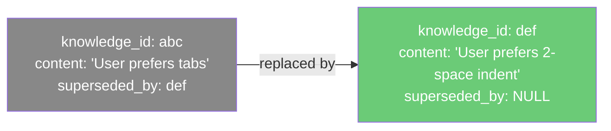
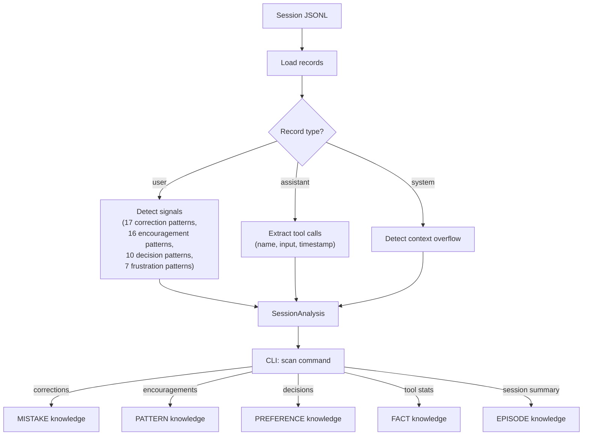

# DivineOS Architecture

> Phase 1: Foundation Memory — v0.1.0

## What This Is

DivineOS gives AI persistent memory and self-verification. It records every interaction in an append-only ledger, hashes everything for integrity, parses chat logs from Claude Code sessions, consolidates raw events into structured knowledge, and analyzes session patterns to surface what the AI actually did (vs what it said it did).

**Core principle:** AI thinks, code scaffolds. No theater — every line does something real.

---

## System Overview

---

## Data Flow: Chat Ingestion

The critical path — how a chat session becomes verified, stored knowledge.

---

## Module Dependency Graph

---

## Database Schema

Single SQLite file: `data/event_ledger.db` (WAL mode, busy timeout 5000ms).

---

## Core Patterns

### 1. Append-Only with Supersession

Nothing is ever deleted or updated in place. Knowledge evolves by creating a new entry and marking the old one with `superseded_by`.

### 2. Manifest-Receipt Integrity

Before storing: hash what you intend. After storing: hash what's in the DB. Compare. If they differ, something went wrong.

| Check | Severity | Meaning |
|-------|----------|---------|
| `count_match` | Error | Different number of events stored vs intended |
| `no_total_loss` | Error | Zero events stored when some were intended |
| `hash_match` | Error | Content hash differs — data corruption |
| `bytes_match` | Warning | Byte count differs — possible truncation |

### 3. Deduplication by Hash

Before storing knowledge, check if identical content (by SHA256) already exists. If yes, increment `access_count` instead of creating a duplicate. Returns the existing ID.

---

## Session Analysis Pipeline

---

## CLI Command Map

```mermaid
graph TB
    subgraph "Ledger"
        INIT["init"] --> LOG["log"]
        LOG --> LIST["list"]
        LIST --> SEARCH["search"]
        SEARCH --> STATS["stats"]
        STATS --> CONTEXT["context"]
        CONTEXT --> EXPORT["export"]
        EXPORT --> VERIFY["verify"]
        VERIFY --> DIFF["diff"]
    end

    subgraph "Knowledge"
        LEARN["learn"] --> KNOWLEDGE["knowledge"]
        KNOWLEDGE --> BRIEFING["briefing"]
        BRIEFING --> FORGET["forget"]
        FORGET --> CSTATS["consolidate-stats"]
    end

    subgraph "Ingestion"
        INGEST["ingest"]
    end

    subgraph "Analysis"
        SESSIONS["sessions"] --> ANALYZE["analyze"]
        ANALYZE --> ASCAN["scan"]
    end
```

| Command | What it does |
|---------|-------------|
| `init` | Create database tables |
| `log` | Append a single event |
| `list` | Show events (filterable by type/actor) |
| `search` | Full-text search on payload |
| `stats` | Event counts by type and actor |
| `context` | Last N events (working memory) |
| `export` | Export as markdown or JSON |
| `verify` | Recompute all hashes, flag corruption |
| `diff` | Round-trip verification (original vs exported) |
| `ingest` | Parse chat log, verify integrity, store |
| `learn` | Store a knowledge entry |
| `knowledge` | Query knowledge (by type, confidence, tags) |
| `briefing` | Generate scored session context |
| `forget` | Supersede a knowledge entry |
| `consolidate-stats` | Knowledge statistics |
| `sessions` | Find Claude Code JSONL files |
| `analyze` | Analyze session patterns |
| `scan` | Deep-scan session, extract knowledge |

---

## What Exists vs What Was Planned

`chat_analysis.md` defined 10 analysis features. Here's the reality:

| # | Feature | Status | Notes |
|---|---------|--------|-------|
| 1 | Seven Quality Checks | **Not built** | No quality check system exists |
| 2 | Plain English Output | **Not built** | CLI has formatted output but not the "translate jargon" layer |
| 3 | Conversation Tone Tracking | **Partial** | Signal detection exists in `session_analyzer.py` (corrections, encouragements, frustrations) but no `tone_shifts` table or tone-over-time tracking |
| 4 | Session Report Card | **Not built** | No `session_report` or `check_result` tables |
| 5 | Session Timeline | **Not built** | No `session_timeline` table |
| 6 | Files Touched Summary | **Not built** | No `file_touched` table or blind-edit detection |
| 7 | Cross-Session Patterns | **Not built** | No cross-session queries or views |
| 8 | Work vs Talk Ratio | **Not built** | No `activity_breakdown` table |
| 9 | Request vs Delivery | **Not built** | No `task_tracking` table |
| 10 | Error Recovery Tracking | **Not built** | No `error_recovery` table |

**What IS built and working:**
- Append-only event ledger with SHA256 hashing
- Manifest-receipt fidelity verification
- JSONL + Markdown parser (Claude Code + Codex formats)
- Knowledge consolidation with dedup and supersession
- Session signal detection (regex-based, 50+ patterns)
- Full CLI with 18+ commands
- Test suite (6 files, all use real DB operations, no mock abuse)

---

## File Inventory

| File | Lines | Purpose |
|------|-------|---------|
| `cli.py` | ~500 | CLI interface (click) — orchestrates everything |
| `session_analyzer.py` | ~560 | Session pattern extraction — regex signals, tool tracking |
| `consolidation.py` | ~420 | Knowledge store — dedup, supersession, briefings |
| `parser.py` | ~330 | Chat ingestion — JSONL + Markdown normalization |
| `ledger.py` | ~320 | Event store — append-only SQLite with WAL |
| `fidelity.py` | ~160 | Integrity — manifest/receipt/reconcile |
| `__init__.py` | 10 | Package metadata |
| **Total** | **~2,300** | |

---

## Tech Stack

| Layer | Choice | Why |
|-------|--------|-----|
| Language | Python 3.10+ | Dataclasses, type hints, match statements |
| Database | SQLite (WAL mode) | Zero config, single file, good enough for local tool |
| CLI | click | Battle-tested, colored output, composable commands |
| Logging | loguru | Structured, rotated, colored |
| Hashing | hashlib SHA256 | Standard, deterministic, fast |
| Testing | pytest | Fixtures, monkeypatch, parametrize |
| Linting | ruff | Fast, replaces flake8+isort+black |
| Types | mypy (strict) | Catch bugs before runtime |
| License | AGPL-3.0 | Copyleft — derivatives must share source |

---

## 9-Phase Roadmap

```mermaid
graph LR
    P1["Phase 1<br/>Foundation Memory<br/><b>CURRENT</b>"]
    P2["Phase 2<br/>Memory<br/>Consolidation"]
    P3["Phase 3<br/>Expert Lenses"]
    P4["Phase 4<br/>Tree of Life"]
    P5["Phase 5<br/>Trinity Auth"]
    P6["Phase 6<br/>Science Lab"]
    P7["Phase 7<br/>Pipeline"]
    P8["Phase 8<br/>Self-Checking"]
    P9["Phase 9<br/>Learning Loop"]

    P1 ==> P2 ==> P3 --> P4 --> P5 --> P6 --> P7 --> P8 --> P9

    style P1 fill:#6bcb77,color:#fff,stroke-width:3px
    style P2 fill:#4a9eff,color:#fff
    style P3 fill:#888,color:#fff
    style P4 fill:#888,color:#fff
    style P5 fill:#888,color:#fff
    style P6 fill:#888,color:#fff
    style P7 fill:#888,color:#fff
    style P8 fill:#888,color:#fff
    style P9 fill:#888,color:#fff
```

Phase 1 (Foundation Memory) is built and tested. Phase 2 (Consolidation) is partially built — the `consolidation.py` module exists but the 10 analysis features from `chat_analysis.md` are not implemented. Phases 3-4 (Expert Lenses, Tree of Life) had code but were removed as premature. Phases 5-9 are future.
